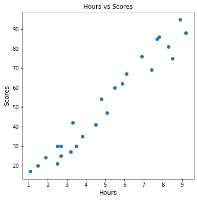
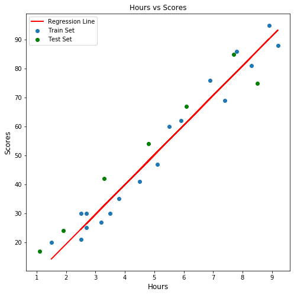
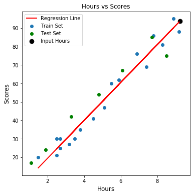

# Submitted By Gomathy Sankar K
## Task 1
### Prediction of Student Scores by the number of study hours

#### Loading in the Required Datasets


```python
import os
import pandas as pd
import numpy as np
import matplotlib.pyplot as plt
from sklearn.linear_model import LinearRegression
```


```python
%matplotlib inline
```

#### Reading in the Student Scores Dataset


```python
student_scores = pd.read_csv('E:\Data Science in Python\GRIP Tasks\student_scores - student_scores.csv')
```


```python
student_scores
```


<div>
<style scoped>
    .dataframe tbody tr th:only-of-type {
        vertical-align: middle;
    }

    .dataframe tbody tr th {
        vertical-align: top;
    }

    .dataframe thead th {
        text-align: right;
    }
</style>
<table border="1" class="dataframe">
  <thead>
    <tr style="text-align: right;">
      <th></th>
      <th>Hours</th>
      <th>Scores</th>
    </tr>
  </thead>
  <tbody>
    <tr>
      <th>0</th>
      <td>2.5</td>
      <td>21</td>
    </tr>
    <tr>
      <th>1</th>
      <td>5.1</td>
      <td>47</td>
    </tr>
    <tr>
      <th>2</th>
      <td>3.2</td>
      <td>27</td>
    </tr>
    <tr>
      <th>3</th>
      <td>8.5</td>
      <td>75</td>
    </tr>
    <tr>
      <th>4</th>
      <td>3.5</td>
      <td>30</td>
    </tr>
    <tr>
      <th>5</th>
      <td>1.5</td>
      <td>20</td>
    </tr>
    <tr>
      <th>6</th>
      <td>9.2</td>
      <td>88</td>
    </tr>
    <tr>
      <th>7</th>
      <td>5.5</td>
      <td>60</td>
    </tr>
    <tr>
      <th>8</th>
      <td>8.3</td>
      <td>81</td>
    </tr>
    <tr>
      <th>9</th>
      <td>2.7</td>
      <td>25</td>
    </tr>
    <tr>
      <th>10</th>
      <td>7.7</td>
      <td>85</td>
    </tr>
    <tr>
      <th>11</th>
      <td>5.9</td>
      <td>62</td>
    </tr>
    <tr>
      <th>12</th>
      <td>4.5</td>
      <td>41</td>
    </tr>
    <tr>
      <th>13</th>
      <td>3.3</td>
      <td>42</td>
    </tr>
    <tr>
      <th>14</th>
      <td>1.1</td>
      <td>17</td>
    </tr>
    <tr>
      <th>15</th>
      <td>8.9</td>
      <td>95</td>
    </tr>
    <tr>
      <th>16</th>
      <td>2.5</td>
      <td>30</td>
    </tr>
    <tr>
      <th>17</th>
      <td>1.9</td>
      <td>24</td>
    </tr>
    <tr>
      <th>18</th>
      <td>6.1</td>
      <td>67</td>
    </tr>
    <tr>
      <th>19</th>
      <td>7.4</td>
      <td>69</td>
    </tr>
    <tr>
      <th>20</th>
      <td>2.7</td>
      <td>30</td>
    </tr>
    <tr>
      <th>21</th>
      <td>4.8</td>
      <td>54</td>
    </tr>
    <tr>
      <th>22</th>
      <td>3.8</td>
      <td>35</td>
    </tr>
    <tr>
      <th>23</th>
      <td>6.9</td>
      <td>76</td>
    </tr>
    <tr>
      <th>24</th>
      <td>7.8</td>
      <td>86</td>
    </tr>
  </tbody>
</table>
</div>


#### Exploratory Data Analysis


```python
fig, ax = plt.subplots(figsize = (6, 6))
ax.scatter(student_scores['Hours'], student_scores['Scores'])
ax.set_xlabel('Hours', fontsize = 12)
ax.set_ylabel('Scores', fontsize = 12)
ax.set_title('Hours vs Scores')
```


    Text(0.5, 1.0, 'Hours vs Scores')





From the above scatter plot we can see that there is a linear relationship between the number of study hours and the scores obtained.

#### Preparing the Training and Test Datasets


```python
from sklearn.model_selection import train_test_split
X_train, X_test, y_train, y_test = train_test_split(student_scores['Hours'].values, student_scores['Scores'].values, 
                                                    random_state = 1)
X_train = X_train.reshape(-1, 1)
y_train = y_train
X_test = X_test.reshape(-1, 1)
y_test = y_test
```

#### Fitting a Linear Regression Model to the Dataset


```python
fit_model = LinearRegression().fit(X_train, y_train)
```


```python
test_predictions = fit_model.predict(X_test)
Test_df = pd.DataFrame({'Actual Scores' : y_test[:], 'Predicted Scores' : test_predictions[:]})
Test_df
```


<div>
<style scoped>
    .dataframe tbody tr th:only-of-type {
        vertical-align: middle;
    }

    .dataframe tbody tr th {
        vertical-align: top;
    }

    .dataframe thead th {
        text-align: right;
    }
</style>
<table border="1" class="dataframe">
  <thead>
    <tr style="text-align: right;">
      <th></th>
      <th>Actual Scores</th>
      <th>Predicted Scores</th>
    </tr>
  </thead>
  <tbody>
    <tr>
      <th>0</th>
      <td>17</td>
      <td>10.151901</td>
    </tr>
    <tr>
      <th>1</th>
      <td>42</td>
      <td>32.739761</td>
    </tr>
    <tr>
      <th>2</th>
      <td>24</td>
      <td>18.365669</td>
    </tr>
    <tr>
      <th>3</th>
      <td>75</td>
      <td>86.129249</td>
    </tr>
    <tr>
      <th>4</th>
      <td>54</td>
      <td>48.140575</td>
    </tr>
    <tr>
      <th>5</th>
      <td>85</td>
      <td>77.915481</td>
    </tr>
    <tr>
      <th>6</th>
      <td>67</td>
      <td>61.487947</td>
    </tr>
  </tbody>
</table>
</div>


```python
import sklearn as sk
import math
mse_error = sk.metrics.mean_squared_error(Test_df['Actual Scores'], Test_df['Predicted Scores'])
print('The Root Mean Squared Error is {}.'.format(math.sqrt(mse_error)))
```

    The Root Mean Squared Error is 7.589093096841797.
    


```python
fig1, ax1 = plt.subplots(figsize = (8, 8))
ax1.scatter(X_train, y_train, label = 'Train Set')
ax1.scatter(X_test, y_test, color = 'green', label = 'Test Set')
ax1.set_xlabel('Hours', fontsize = 12)
ax1.set_ylabel('Scores', fontsize = 12)
ax1.set_title('Hours vs Scores')
ax1.plot(X_train, fit_model.intercept_ + (fit_model.coef_ * X_train), color = 'red', linewidth = 2, label = 'Regression Line')
ax1.legend(loc = 'upper left')
```


    <matplotlib.legend.Legend at 0x1cdac4c53c8>





#### Score Prediction for the Required Hours 


```python
Reqd_Hours = np.array(9.25).reshape(1, -1)
Predicted_Score = fit_model.predict(Reqd_Hours)
Predicted_Score[0]
```


    93.82965552496633


```python
fig2, ax2 = plt.subplots(figsize = (6, 6))
ax2.scatter(X_train, y_train, label = 'Train Set')
ax2.scatter(X_test, y_test, color = 'green', label = 'Test Set')
ax2.set_xlabel('Hours', fontsize = 12)
ax2.set_ylabel('Scores', fontsize = 12)
ax2.set_title('Hours vs Scores')
ax2.plot(X_train, fit_model.predict(X_train), color = 'red', linewidth = 2, label = 'Regression Line')
ax2.scatter(Reqd_Hours, Predicted_Score[0], color = 'black', s = 75, label = 'Input Hours')
ax2.legend(loc = 'upper left')
```


    <matplotlib.legend.Legend at 0x1cdac51ae08>





### Thank You
