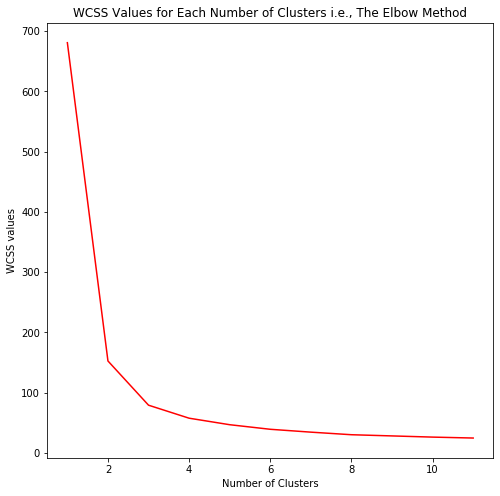
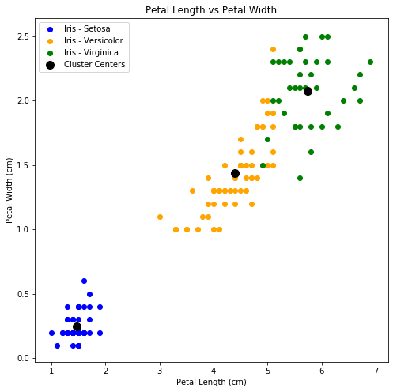

# Submitted by Gomathy Sankar K
## Task 2
### Predicting the optimum number of clusters for the Iris Dataset

#### Loading in the Libraries


```python
import os
import pandas as pd
import numpy as np
from sklearn.cluster import KMeans
import seaborn as sns
import matplotlib.pyplot as plt
```

#### Iris Dataset 


```python
iris = pd.read_csv('E:\Data Science in Python\GRIP Tasks\Iris.csv')
iris = iris.set_index('Id')
iris
```


<div>
<style scoped>
    .dataframe tbody tr th:only-of-type {
        vertical-align: middle;
    }

    .dataframe tbody tr th {
        vertical-align: top;
    }

    .dataframe thead th {
        text-align: right;
    }
</style>
<table border="1" class="dataframe">
  <thead>
    <tr style="text-align: right;">
      <th></th>
      <th>SepalLengthCm</th>
      <th>SepalWidthCm</th>
      <th>PetalLengthCm</th>
      <th>PetalWidthCm</th>
      <th>Species</th>
    </tr>
    <tr>
      <th>Id</th>
      <th></th>
      <th></th>
      <th></th>
      <th></th>
      <th></th>
    </tr>
  </thead>
  <tbody>
    <tr>
      <th>1</th>
      <td>5.1</td>
      <td>3.5</td>
      <td>1.4</td>
      <td>0.2</td>
      <td>Iris-setosa</td>
    </tr>
    <tr>
      <th>2</th>
      <td>4.9</td>
      <td>3.0</td>
      <td>1.4</td>
      <td>0.2</td>
      <td>Iris-setosa</td>
    </tr>
    <tr>
      <th>3</th>
      <td>4.7</td>
      <td>3.2</td>
      <td>1.3</td>
      <td>0.2</td>
      <td>Iris-setosa</td>
    </tr>
    <tr>
      <th>4</th>
      <td>4.6</td>
      <td>3.1</td>
      <td>1.5</td>
      <td>0.2</td>
      <td>Iris-setosa</td>
    </tr>
    <tr>
      <th>5</th>
      <td>5.0</td>
      <td>3.6</td>
      <td>1.4</td>
      <td>0.2</td>
      <td>Iris-setosa</td>
    </tr>
    <tr>
      <th>...</th>
      <td>...</td>
      <td>...</td>
      <td>...</td>
      <td>...</td>
      <td>...</td>
    </tr>
    <tr>
      <th>146</th>
      <td>6.7</td>
      <td>3.0</td>
      <td>5.2</td>
      <td>2.3</td>
      <td>Iris-virginica</td>
    </tr>
    <tr>
      <th>147</th>
      <td>6.3</td>
      <td>2.5</td>
      <td>5.0</td>
      <td>1.9</td>
      <td>Iris-virginica</td>
    </tr>
    <tr>
      <th>148</th>
      <td>6.5</td>
      <td>3.0</td>
      <td>5.2</td>
      <td>2.0</td>
      <td>Iris-virginica</td>
    </tr>
    <tr>
      <th>149</th>
      <td>6.2</td>
      <td>3.4</td>
      <td>5.4</td>
      <td>2.3</td>
      <td>Iris-virginica</td>
    </tr>
    <tr>
      <th>150</th>
      <td>5.9</td>
      <td>3.0</td>
      <td>5.1</td>
      <td>1.8</td>
      <td>Iris-virginica</td>
    </tr>
  </tbody>
</table>
<p>150 rows × 5 columns</p>
</div>


```python
iris.describe()
```


<div>
<style scoped>
    .dataframe tbody tr th:only-of-type {
        vertical-align: middle;
    }

    .dataframe tbody tr th {
        vertical-align: top;
    }

    .dataframe thead th {
        text-align: right;
    }
</style>
<table border="1" class="dataframe">
  <thead>
    <tr style="text-align: right;">
      <th></th>
      <th>SepalLengthCm</th>
      <th>SepalWidthCm</th>
      <th>PetalLengthCm</th>
      <th>PetalWidthCm</th>
    </tr>
  </thead>
  <tbody>
    <tr>
      <th>count</th>
      <td>150.000000</td>
      <td>150.000000</td>
      <td>150.000000</td>
      <td>150.000000</td>
    </tr>
    <tr>
      <th>mean</th>
      <td>5.843333</td>
      <td>3.054000</td>
      <td>3.758667</td>
      <td>1.198667</td>
    </tr>
    <tr>
      <th>std</th>
      <td>0.828066</td>
      <td>0.433594</td>
      <td>1.764420</td>
      <td>0.763161</td>
    </tr>
    <tr>
      <th>min</th>
      <td>4.300000</td>
      <td>2.000000</td>
      <td>1.000000</td>
      <td>0.100000</td>
    </tr>
    <tr>
      <th>25%</th>
      <td>5.100000</td>
      <td>2.800000</td>
      <td>1.600000</td>
      <td>0.300000</td>
    </tr>
    <tr>
      <th>50%</th>
      <td>5.800000</td>
      <td>3.000000</td>
      <td>4.350000</td>
      <td>1.300000</td>
    </tr>
    <tr>
      <th>75%</th>
      <td>6.400000</td>
      <td>3.300000</td>
      <td>5.100000</td>
      <td>1.800000</td>
    </tr>
    <tr>
      <th>max</th>
      <td>7.900000</td>
      <td>4.400000</td>
      <td>6.900000</td>
      <td>2.500000</td>
    </tr>
  </tbody>
</table>
</div>


#### Exploratory Data Analysis


```python
sns.pairplot(iris, hue = 'Species')
```


    <seaborn.axisgrid.PairGrid at 0x1abdecb12c8>


#### Fitting Different KMeans Clustering Models


```python
kmeans_wcss = []
#wcss means Within Cluster Sum of Squares

Iris_values = iris.iloc[:, [0, 1, 2, 3]].values

for i in range(1, 12):
    kmeans = KMeans(n_clusters = i, random_state = 0, n_jobs = -1)
    kmeans.fit(Iris_values)
    kmeans_wcss.append(kmeans.inertia_)
    #kmeans.inertia_ returns the sum of squared distances of samples to their closest center
```

#### Finding the optimum KMeans Cluster Model using Elbow Method


```python
fig, ax = plt.subplots(figsize = (8, 8))
ax.plot(range(1, 12), kmeans_wcss, color = 'red')
ax.set_xlabel('Number of Clusters', fontsize = 10)
ax.set_ylabel('WCSS values')
ax.set_title('WCSS Values for Each Number of Clusters i.e., The Elbow Method')
```


    Text(0.5, 1.0, 'WCSS Values for Each Number of Clusters i.e., The Elbow Method')





It is evident from the above graph that after the number of clusters is more than 3 the decrease in the Within Cluster Sum of Squares is less. It is also the point at which the elbow occurs. 
So We can select the optimum number of clusters for the iris dataset to be 3.

#### Visualization of the Optimum KMeans Cluster Model


```python
Final_Model = KMeans(n_clusters = 3, random_state = 0, n_jobs = -1)
Final_Model.fit_predict(Iris_values)

fig1, ax1 = plt.subplots(figsize = (8, 8))
ax1.scatter(Iris_values[Final_Model.labels_ == 1, 2], Iris_values[Final_Model.labels_ == 1, 3], color = 'blue', 
           label = 'Iris - Setosa')
ax1.scatter(Iris_values[Final_Model.labels_ == 2, 2], Iris_values[Final_Model.labels_ == 2, 3], color = 'orange', 
           label = 'Iris - Versicolor')
ax1.scatter(Iris_values[Final_Model.labels_ == 0, 2], Iris_values[Final_Model.labels_ == 0, 3], color = 'green', 
           label = 'Iris - Virginica')

ax1.scatter(Final_Model.cluster_centers_[:, 2], Final_Model.cluster_centers_[:, 3], color = 'black', 
            s = 100, label = 'Cluster Centers')
ax1.legend()
ax1.set_xlabel('Petal Length (cm)')
ax1.set_ylabel('Petal Width (cm)')
ax1.set_title('Petal Length vs Petal Width')
#Final_Model.labels_
```


    Text(0.5, 1.0, 'Petal Length vs Petal Width')





## Thank You
