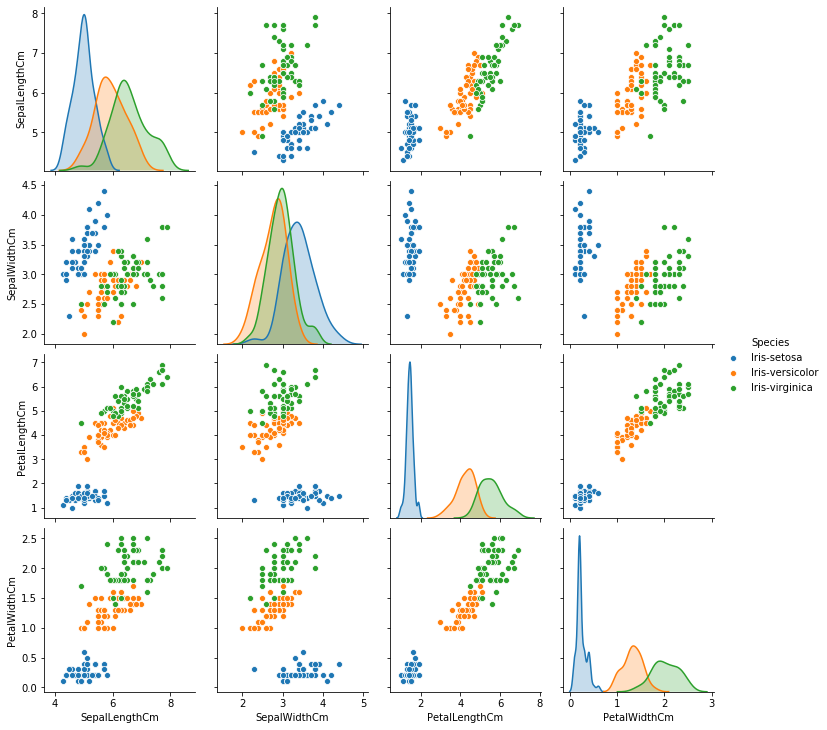
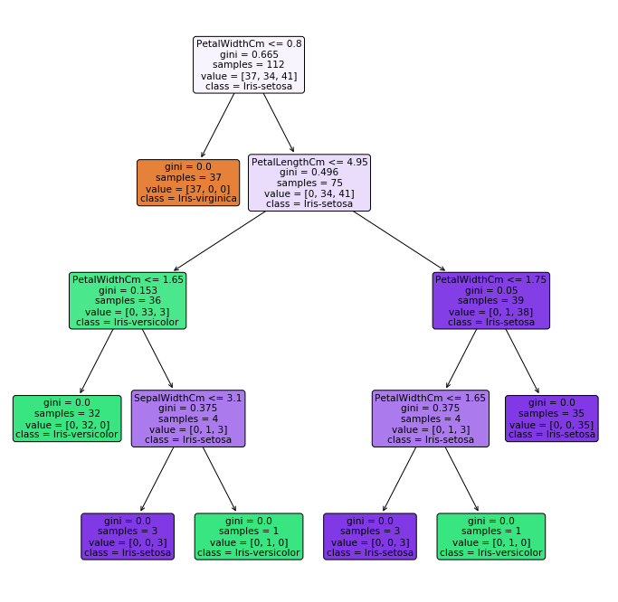

# Submitted by Gomathy Sankar K
## Task 3
### Predicting the Iris Species using Decision Tree Algorithm

#### Loading in the Libraries


```python
import os
import pandas as pd
import numpy as np
import seaborn as sns
import matplotlib.pyplot as plt
from sklearn.tree import DecisionTreeClassifier
from sklearn.tree import plot_tree
```

#### Iris Dataset 


```python
iris = pd.read_csv('E:\Data Science in Python\GRIP Tasks\Iris.csv')
iris = iris.set_index('Id')
iris
```


<div>
<style scoped>
    .dataframe tbody tr th:only-of-type {
        vertical-align: middle;
    }

    .dataframe tbody tr th {
        vertical-align: top;
    }

    .dataframe thead th {
        text-align: right;
    }
</style>
<table border="1" class="dataframe">
  <thead>
    <tr style="text-align: right;">
      <th></th>
      <th>SepalLengthCm</th>
      <th>SepalWidthCm</th>
      <th>PetalLengthCm</th>
      <th>PetalWidthCm</th>
      <th>Species</th>
    </tr>
    <tr>
      <th>Id</th>
      <th></th>
      <th></th>
      <th></th>
      <th></th>
      <th></th>
    </tr>
  </thead>
  <tbody>
    <tr>
      <th>1</th>
      <td>5.1</td>
      <td>3.5</td>
      <td>1.4</td>
      <td>0.2</td>
      <td>Iris-setosa</td>
    </tr>
    <tr>
      <th>2</th>
      <td>4.9</td>
      <td>3.0</td>
      <td>1.4</td>
      <td>0.2</td>
      <td>Iris-setosa</td>
    </tr>
    <tr>
      <th>3</th>
      <td>4.7</td>
      <td>3.2</td>
      <td>1.3</td>
      <td>0.2</td>
      <td>Iris-setosa</td>
    </tr>
    <tr>
      <th>4</th>
      <td>4.6</td>
      <td>3.1</td>
      <td>1.5</td>
      <td>0.2</td>
      <td>Iris-setosa</td>
    </tr>
    <tr>
      <th>5</th>
      <td>5.0</td>
      <td>3.6</td>
      <td>1.4</td>
      <td>0.2</td>
      <td>Iris-setosa</td>
    </tr>
    <tr>
      <th>...</th>
      <td>...</td>
      <td>...</td>
      <td>...</td>
      <td>...</td>
      <td>...</td>
    </tr>
    <tr>
      <th>146</th>
      <td>6.7</td>
      <td>3.0</td>
      <td>5.2</td>
      <td>2.3</td>
      <td>Iris-virginica</td>
    </tr>
    <tr>
      <th>147</th>
      <td>6.3</td>
      <td>2.5</td>
      <td>5.0</td>
      <td>1.9</td>
      <td>Iris-virginica</td>
    </tr>
    <tr>
      <th>148</th>
      <td>6.5</td>
      <td>3.0</td>
      <td>5.2</td>
      <td>2.0</td>
      <td>Iris-virginica</td>
    </tr>
    <tr>
      <th>149</th>
      <td>6.2</td>
      <td>3.4</td>
      <td>5.4</td>
      <td>2.3</td>
      <td>Iris-virginica</td>
    </tr>
    <tr>
      <th>150</th>
      <td>5.9</td>
      <td>3.0</td>
      <td>5.1</td>
      <td>1.8</td>
      <td>Iris-virginica</td>
    </tr>
  </tbody>
</table>
<p>150 rows × 5 columns</p>
</div>


```python
iris.describe()
```


<div>
<style scoped>
    .dataframe tbody tr th:only-of-type {
        vertical-align: middle;
    }

    .dataframe tbody tr th {
        vertical-align: top;
    }

    .dataframe thead th {
        text-align: right;
    }
</style>
<table border="1" class="dataframe">
  <thead>
    <tr style="text-align: right;">
      <th></th>
      <th>SepalLengthCm</th>
      <th>SepalWidthCm</th>
      <th>PetalLengthCm</th>
      <th>PetalWidthCm</th>
    </tr>
  </thead>
  <tbody>
    <tr>
      <th>count</th>
      <td>150.000000</td>
      <td>150.000000</td>
      <td>150.000000</td>
      <td>150.000000</td>
    </tr>
    <tr>
      <th>mean</th>
      <td>5.843333</td>
      <td>3.054000</td>
      <td>3.758667</td>
      <td>1.198667</td>
    </tr>
    <tr>
      <th>std</th>
      <td>0.828066</td>
      <td>0.433594</td>
      <td>1.764420</td>
      <td>0.763161</td>
    </tr>
    <tr>
      <th>min</th>
      <td>4.300000</td>
      <td>2.000000</td>
      <td>1.000000</td>
      <td>0.100000</td>
    </tr>
    <tr>
      <th>25%</th>
      <td>5.100000</td>
      <td>2.800000</td>
      <td>1.600000</td>
      <td>0.300000</td>
    </tr>
    <tr>
      <th>50%</th>
      <td>5.800000</td>
      <td>3.000000</td>
      <td>4.350000</td>
      <td>1.300000</td>
    </tr>
    <tr>
      <th>75%</th>
      <td>6.400000</td>
      <td>3.300000</td>
      <td>5.100000</td>
      <td>1.800000</td>
    </tr>
    <tr>
      <th>max</th>
      <td>7.900000</td>
      <td>4.400000</td>
      <td>6.900000</td>
      <td>2.500000</td>
    </tr>
  </tbody>
</table>
</div>


#### Exploratory Data Analysis


```python
sns.pairplot(iris, hue = 'Species')
```


    <seaborn.axisgrid.PairGrid at 0x279895fdd48>





#### Creating Training and Test Datasets


```python
from sklearn.model_selection import train_test_split

X = iris.iloc[:, 0:4].values
y = iris.iloc[:, -1].values

X_train, X_test, y_train, y_test = train_test_split(X, y, random_state = 0)
```

#### Decision Tree Classification


```python
tree_fit = DecisionTreeClassifier(random_state = 0)
tree_fit.fit(X_train, y_train)

fig1, ax1 = plt.subplots(figsize = (12, 12))
plot_tree(tree_fit, feature_names = iris.columns, filled = True, rounded = True, 
          class_names = list(set(iris['Species'].values)), ax = ax1)
```


    [Text(267.84000000000003, 587.0880000000001, 'PetalWidthCm <= 0.8\ngini = 0.665\nsamples = 112\nvalue = [37, 34, 41]\nclass = Iris-setosa'),
     Text(200.88000000000002, 456.624, 'gini = 0.0\nsamples = 37\nvalue = [37, 0, 0]\nclass = Iris-virginica'),
     Text(334.80000000000007, 456.624, 'PetalLengthCm <= 4.95\ngini = 0.496\nsamples = 75\nvalue = [0, 34, 41]\nclass = Iris-setosa'),
     Text(133.92000000000002, 326.1600000000001, 'PetalWidthCm <= 1.65\ngini = 0.153\nsamples = 36\nvalue = [0, 33, 3]\nclass = Iris-versicolor'),
     Text(66.96000000000001, 195.69600000000003, 'gini = 0.0\nsamples = 32\nvalue = [0, 32, 0]\nclass = Iris-versicolor'),
     Text(200.88000000000002, 195.69600000000003, 'SepalWidthCm <= 3.1\ngini = 0.375\nsamples = 4\nvalue = [0, 1, 3]\nclass = Iris-setosa'),
     Text(133.92000000000002, 65.23200000000008, 'gini = 0.0\nsamples = 3\nvalue = [0, 0, 3]\nclass = Iris-setosa'),
     Text(267.84000000000003, 65.23200000000008, 'gini = 0.0\nsamples = 1\nvalue = [0, 1, 0]\nclass = Iris-versicolor'),
     Text(535.6800000000001, 326.1600000000001, 'PetalWidthCm <= 1.75\ngini = 0.05\nsamples = 39\nvalue = [0, 1, 38]\nclass = Iris-setosa'),
     Text(468.72, 195.69600000000003, 'PetalWidthCm <= 1.65\ngini = 0.375\nsamples = 4\nvalue = [0, 1, 3]\nclass = Iris-setosa'),
     Text(401.76000000000005, 65.23200000000008, 'gini = 0.0\nsamples = 3\nvalue = [0, 0, 3]\nclass = Iris-setosa'),
     Text(535.6800000000001, 65.23200000000008, 'gini = 0.0\nsamples = 1\nvalue = [0, 1, 0]\nclass = Iris-versicolor'),
     Text(602.6400000000001, 195.69600000000003, 'gini = 0.0\nsamples = 35\nvalue = [0, 0, 35]\nclass = Iris-setosa')]





#### Performing Predictions based on the Decision Tree Classification Model


```python
y_pred = tree_fit.predict(X_test)

from sklearn.metrics import confusion_matrix, classification_report, accuracy_score

report = classification_report(y_test, y_pred, output_dict = True)
report = pd.DataFrame(report)
report
```


<div>
<style scoped>
    .dataframe tbody tr th:only-of-type {
        vertical-align: middle;
    }

    .dataframe tbody tr th {
        vertical-align: top;
    }

    .dataframe thead th {
        text-align: right;
    }
</style>
<table border="1" class="dataframe">
  <thead>
    <tr style="text-align: right;">
      <th></th>
      <th>Iris-setosa</th>
      <th>Iris-versicolor</th>
      <th>Iris-virginica</th>
      <th>accuracy</th>
      <th>macro avg</th>
      <th>weighted avg</th>
    </tr>
  </thead>
  <tbody>
    <tr>
      <th>precision</th>
      <td>1.0</td>
      <td>1.000000</td>
      <td>0.900000</td>
      <td>0.973684</td>
      <td>0.966667</td>
      <td>0.976316</td>
    </tr>
    <tr>
      <th>recall</th>
      <td>1.0</td>
      <td>0.937500</td>
      <td>1.000000</td>
      <td>0.973684</td>
      <td>0.979167</td>
      <td>0.973684</td>
    </tr>
    <tr>
      <th>f1-score</th>
      <td>1.0</td>
      <td>0.967742</td>
      <td>0.947368</td>
      <td>0.973684</td>
      <td>0.971703</td>
      <td>0.973952</td>
    </tr>
    <tr>
      <th>support</th>
      <td>13.0</td>
      <td>16.000000</td>
      <td>9.000000</td>
      <td>0.973684</td>
      <td>38.000000</td>
      <td>38.000000</td>
    </tr>
  </tbody>
</table>
</div>


```python
confusion_matrix(y_test, y_pred)
```


    array([[13,  0,  0],
           [ 0, 15,  1],
           [ 0,  0,  9]], dtype=int64)


```python
accuracy_score(y_test, y_pred)
```


    0.9736842105263158


## Thank You
