# Submitted by Gomathy Sankar K
## Task 5
### Derive Business Insights from the SampleSuperStore Dataset

### Libraries


```python
import os
import pandas as pd
import numpy as np
import matplotlib.pyplot as plt

```


```python
%matplotlib inline
```

### Dataset


```python
store = pd.read_csv('E:\Data Science in Python\GRIP Tasks\SampleSuperStore.csv')
store
```


<div>
<style scoped>
    .dataframe tbody tr th:only-of-type {
        vertical-align: middle;
    }

    .dataframe tbody tr th {
        vertical-align: top;
    }

    .dataframe thead th {
        text-align: right;
    }
</style>
<table border="1" class="dataframe">
  <thead>
    <tr style="text-align: right;">
      <th></th>
      <th>Ship Mode</th>
      <th>Segment</th>
      <th>Country</th>
      <th>City</th>
      <th>State</th>
      <th>Postal Code</th>
      <th>Region</th>
      <th>Category</th>
      <th>Sub-Category</th>
      <th>Sales</th>
      <th>Quantity</th>
      <th>Discount</th>
      <th>Profit</th>
    </tr>
  </thead>
  <tbody>
    <tr>
      <th>0</th>
      <td>Second Class</td>
      <td>Consumer</td>
      <td>United States</td>
      <td>Henderson</td>
      <td>Kentucky</td>
      <td>42420</td>
      <td>South</td>
      <td>Furniture</td>
      <td>Bookcases</td>
      <td>261.9600</td>
      <td>2</td>
      <td>0.00</td>
      <td>41.9136</td>
    </tr>
    <tr>
      <th>1</th>
      <td>Second Class</td>
      <td>Consumer</td>
      <td>United States</td>
      <td>Henderson</td>
      <td>Kentucky</td>
      <td>42420</td>
      <td>South</td>
      <td>Furniture</td>
      <td>Chairs</td>
      <td>731.9400</td>
      <td>3</td>
      <td>0.00</td>
      <td>219.5820</td>
    </tr>
    <tr>
      <th>2</th>
      <td>Second Class</td>
      <td>Corporate</td>
      <td>United States</td>
      <td>Los Angeles</td>
      <td>California</td>
      <td>90036</td>
      <td>West</td>
      <td>Office Supplies</td>
      <td>Labels</td>
      <td>14.6200</td>
      <td>2</td>
      <td>0.00</td>
      <td>6.8714</td>
    </tr>
    <tr>
      <th>3</th>
      <td>Standard Class</td>
      <td>Consumer</td>
      <td>United States</td>
      <td>Fort Lauderdale</td>
      <td>Florida</td>
      <td>33311</td>
      <td>South</td>
      <td>Furniture</td>
      <td>Tables</td>
      <td>957.5775</td>
      <td>5</td>
      <td>0.45</td>
      <td>-383.0310</td>
    </tr>
    <tr>
      <th>4</th>
      <td>Standard Class</td>
      <td>Consumer</td>
      <td>United States</td>
      <td>Fort Lauderdale</td>
      <td>Florida</td>
      <td>33311</td>
      <td>South</td>
      <td>Office Supplies</td>
      <td>Storage</td>
      <td>22.3680</td>
      <td>2</td>
      <td>0.20</td>
      <td>2.5164</td>
    </tr>
    <tr>
      <th>...</th>
      <td>...</td>
      <td>...</td>
      <td>...</td>
      <td>...</td>
      <td>...</td>
      <td>...</td>
      <td>...</td>
      <td>...</td>
      <td>...</td>
      <td>...</td>
      <td>...</td>
      <td>...</td>
      <td>...</td>
    </tr>
    <tr>
      <th>9989</th>
      <td>Second Class</td>
      <td>Consumer</td>
      <td>United States</td>
      <td>Miami</td>
      <td>Florida</td>
      <td>33180</td>
      <td>South</td>
      <td>Furniture</td>
      <td>Furnishings</td>
      <td>25.2480</td>
      <td>3</td>
      <td>0.20</td>
      <td>4.1028</td>
    </tr>
    <tr>
      <th>9990</th>
      <td>Standard Class</td>
      <td>Consumer</td>
      <td>United States</td>
      <td>Costa Mesa</td>
      <td>California</td>
      <td>92627</td>
      <td>West</td>
      <td>Furniture</td>
      <td>Furnishings</td>
      <td>91.9600</td>
      <td>2</td>
      <td>0.00</td>
      <td>15.6332</td>
    </tr>
    <tr>
      <th>9991</th>
      <td>Standard Class</td>
      <td>Consumer</td>
      <td>United States</td>
      <td>Costa Mesa</td>
      <td>California</td>
      <td>92627</td>
      <td>West</td>
      <td>Technology</td>
      <td>Phones</td>
      <td>258.5760</td>
      <td>2</td>
      <td>0.20</td>
      <td>19.3932</td>
    </tr>
    <tr>
      <th>9992</th>
      <td>Standard Class</td>
      <td>Consumer</td>
      <td>United States</td>
      <td>Costa Mesa</td>
      <td>California</td>
      <td>92627</td>
      <td>West</td>
      <td>Office Supplies</td>
      <td>Paper</td>
      <td>29.6000</td>
      <td>4</td>
      <td>0.00</td>
      <td>13.3200</td>
    </tr>
    <tr>
      <th>9993</th>
      <td>Second Class</td>
      <td>Consumer</td>
      <td>United States</td>
      <td>Westminster</td>
      <td>California</td>
      <td>92683</td>
      <td>West</td>
      <td>Office Supplies</td>
      <td>Appliances</td>
      <td>243.1600</td>
      <td>2</td>
      <td>0.00</td>
      <td>72.9480</td>
    </tr>
  </tbody>
</table>
<p>9994 rows × 13 columns</p>
</div>


### Unique Values in Each Variable of the Dataset


```python
set(store['Segment'].values)
```


    {'Consumer', 'Corporate', 'Home Office'}


```python
set(store['Ship Mode'].values)
```


    {'First Class', 'Same Day', 'Second Class', 'Standard Class'}


```python
set(store['Category'].values)
```


    {'Furniture', 'Office Supplies', 'Technology'}


```python
set(store['Sub-Category'].values)
```


    {'Accessories',
     'Appliances',
     'Art',
     'Binders',
     'Bookcases',
     'Chairs',
     'Copiers',
     'Envelopes',
     'Fasteners',
     'Furnishings',
     'Labels',
     'Machines',
     'Paper',
     'Phones',
     'Storage',
     'Supplies',
     'Tables'}


### Sales Analysis with respect to Each Variable in the Dataset


```python
df = store.copy().groupby('Ship Mode')
Sales = df['Sales'].sum()
Sales.plot.pie(y = 'Sales', autopct = '%.0f%%', figsize = (6, 6))
Sales
```


    Ship Mode
    First Class       3.514284e+05
    Same Day          1.283631e+05
    Second Class      4.591936e+05
    Standard Class    1.358216e+06
    Name: Sales, dtype: float64


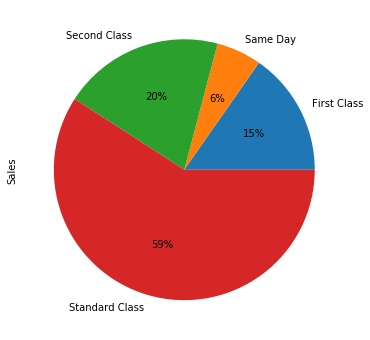


This pie plot represents the sales made with respect to different types of Ship Modes.
We can see that the **Standard Class** mode has the highest sales more than 50% and the **Same Day** mode has the lowest sales.


```python
df = store.copy().groupby('Segment')
Sales = df['Sales'].sum()
Sales.plot.pie(y = 'Sales', autopct = '%.0f%%', figsize = (6, 6))
```


    <matplotlib.axes._subplots.AxesSubplot at 0x1b697073b88>


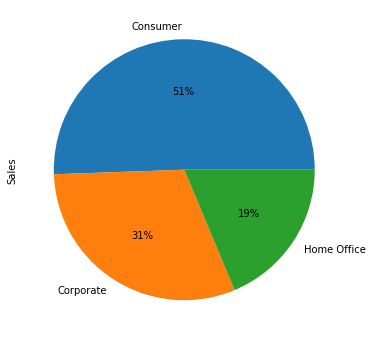


This graph shows that the sales is highest with the **Consumers** than the others.


```python
df = store.copy().groupby('Category')
Sales = df['Sales'].sum()
Sales.plot.pie(figsize = (6, 6), autopct = '%.0f%%')
```


    <matplotlib.axes._subplots.AxesSubplot at 0x1b6970cc4c8>


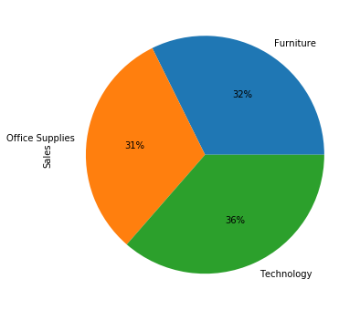


It can be found that the sales in the 3 different categories are almost similar with each other.


```python
df = store.copy().groupby('Sub-Category')
Sales = df['Sales'].sum()
Sales.plot.pie(figsize = (6, 6), autopct = '%.0f%%')
```


    <matplotlib.axes._subplots.AxesSubplot at 0x1b6971255c8>


The above pie graph shows that the products that were highest sold are mainly **Chairs** and **Phones** while the **Fasteners**, **Envelopes** and **Art** are sold very less compared to all others.


```python
df = store.copy().groupby(['Region', 'Category'])
Sales = df['Sales'].sum()
Sales.unstack().plot.bar(figsize = (6, 6))#stacked = True, 
Sales.unstack()
```


<div>
<style scoped>
    .dataframe tbody tr th:only-of-type {
        vertical-align: middle;
    }

    .dataframe tbody tr th {
        vertical-align: top;
    }

    .dataframe thead th {
        text-align: right;
    }
</style>
<table border="1" class="dataframe">
  <thead>
    <tr style="text-align: right;">
      <th>Category</th>
      <th>Furniture</th>
      <th>Office Supplies</th>
      <th>Technology</th>
    </tr>
    <tr>
      <th>Region</th>
      <th></th>
      <th></th>
      <th></th>
    </tr>
  </thead>
  <tbody>
    <tr>
      <th>Central</th>
      <td>163797.1638</td>
      <td>167026.415</td>
      <td>170416.312</td>
    </tr>
    <tr>
      <th>East</th>
      <td>208291.2040</td>
      <td>205516.055</td>
      <td>264973.981</td>
    </tr>
    <tr>
      <th>South</th>
      <td>117298.6840</td>
      <td>125651.313</td>
      <td>148771.908</td>
    </tr>
    <tr>
      <th>West</th>
      <td>252612.7435</td>
      <td>220853.249</td>
      <td>251991.832</td>
    </tr>
  </tbody>
</table>
</div>


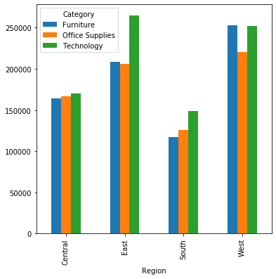


It is evident from the above graph that the sales of the products of all the 3 categories is higher in **West and East** regions and lowest in *South* region.  
So, sales of all the product categories are to be increased in the southern region.  
Since, the sales of the products related to Technology is very high is **eastern** region more number of products of that category can be sold in that area and a considerable level of profit can be earned easily.


```python
df = store.copy().groupby(['Sub-Category', 'Region'])
Sales = df['Sales'].sum()
Sales.unstack().dropna().plot.bar(stacked = True, figsize = (16, 8))
Sales.unstack()
```


<div>
<style scoped>
    .dataframe tbody tr th:only-of-type {
        vertical-align: middle;
    }

    .dataframe tbody tr th {
        vertical-align: top;
    }

    .dataframe thead th {
        text-align: right;
    }
</style>
<table border="1" class="dataframe">
  <thead>
    <tr style="text-align: right;">
      <th>Region</th>
      <th>Central</th>
      <th>East</th>
      <th>South</th>
      <th>West</th>
    </tr>
    <tr>
      <th>Sub-Category</th>
      <th></th>
      <th></th>
      <th></th>
      <th></th>
    </tr>
  </thead>
  <tbody>
    <tr>
      <th>Accessories</th>
      <td>33956.0760</td>
      <td>45033.372</td>
      <td>27276.754</td>
      <td>61114.1160</td>
    </tr>
    <tr>
      <th>Appliances</th>
      <td>23582.0330</td>
      <td>34188.466</td>
      <td>19525.326</td>
      <td>30236.3360</td>
    </tr>
    <tr>
      <th>Art</th>
      <td>5765.3400</td>
      <td>7485.764</td>
      <td>4655.622</td>
      <td>9212.0660</td>
    </tr>
    <tr>
      <th>Binders</th>
      <td>56923.2820</td>
      <td>53497.997</td>
      <td>37030.341</td>
      <td>55961.1130</td>
    </tr>
    <tr>
      <th>Bookcases</th>
      <td>24157.1768</td>
      <td>43819.334</td>
      <td>10899.362</td>
      <td>36004.1235</td>
    </tr>
    <tr>
      <th>Chairs</th>
      <td>85230.6460</td>
      <td>96260.683</td>
      <td>45176.446</td>
      <td>101781.3280</td>
    </tr>
    <tr>
      <th>Copiers</th>
      <td>37259.5700</td>
      <td>53219.462</td>
      <td>9299.756</td>
      <td>49749.2420</td>
    </tr>
    <tr>
      <th>Envelopes</th>
      <td>4636.8720</td>
      <td>4375.874</td>
      <td>3345.556</td>
      <td>4118.1000</td>
    </tr>
    <tr>
      <th>Fasteners</th>
      <td>778.0300</td>
      <td>819.718</td>
      <td>503.316</td>
      <td>923.2160</td>
    </tr>
    <tr>
      <th>Furnishings</th>
      <td>15254.3700</td>
      <td>29071.380</td>
      <td>17306.684</td>
      <td>30072.7300</td>
    </tr>
    <tr>
      <th>Labels</th>
      <td>2451.4720</td>
      <td>2602.934</td>
      <td>2353.180</td>
      <td>5078.7260</td>
    </tr>
    <tr>
      <th>Machines</th>
      <td>26797.3840</td>
      <td>66106.165</td>
      <td>53890.960</td>
      <td>42444.1220</td>
    </tr>
    <tr>
      <th>Paper</th>
      <td>17491.9020</td>
      <td>20172.602</td>
      <td>14150.984</td>
      <td>26663.7180</td>
    </tr>
    <tr>
      <th>Phones</th>
      <td>72403.2820</td>
      <td>100614.982</td>
      <td>58304.438</td>
      <td>98684.3520</td>
    </tr>
    <tr>
      <th>Storage</th>
      <td>45930.1120</td>
      <td>71612.584</td>
      <td>35768.060</td>
      <td>70532.8520</td>
    </tr>
    <tr>
      <th>Supplies</th>
      <td>9467.3720</td>
      <td>10760.116</td>
      <td>8318.928</td>
      <td>18127.1220</td>
    </tr>
    <tr>
      <th>Tables</th>
      <td>39154.9710</td>
      <td>39139.807</td>
      <td>43916.192</td>
      <td>84754.5620</td>
    </tr>
  </tbody>
</table>
</div>


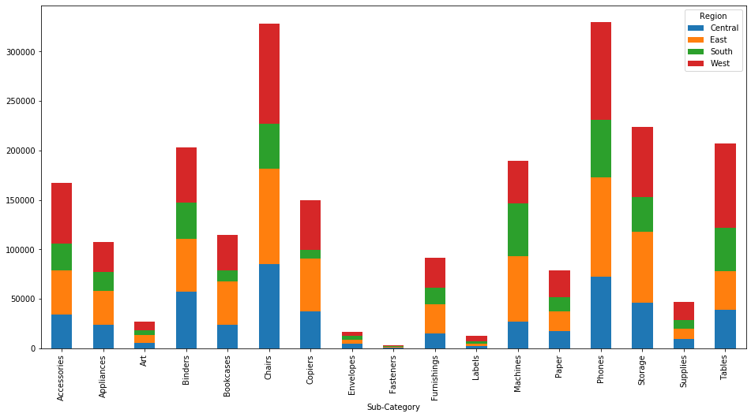


The best selling products in the West and East regions are **Chairs, Phones and Storage**. 
The best selling products in the southern region is **Machines, Phones and Chairs**.
The best selling products in the central region is **Chairs, Phones and Binders**.

Some of the products that are not sold very much in any region are **Art, Envelopes, Fasteners and Labels**.


```python
df = store.copy().groupby(['State', 'Category'])
Sales = df['Sales'].sum()
Sales.unstack().dropna().plot.bar(stacked = True, figsize = (16, 8))
```


    <matplotlib.axes._subplots.AxesSubplot at 0x1b698359c08>


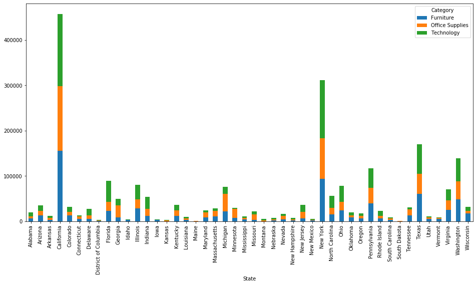


It is evident from the above graph that the total sales is highest in **California** followed by **New York**, **Texas**, **Washington** and **Pennsylvania**.  
The states with very low sales are *District of Columbia*, *Idaho*, *Iowa*, *Kansas*, *Maine*, *Montona*, *New Mexico* and *South Carolina*.  
So the business in these states needs to be improved a lot which can bring in new customers and improve the sales further.

### Profit Analysis with respect to Each Variable


```python
df = store.copy().groupby('Category')
Sales = df['Profit'].sum()
Sales.plot.pie(figsize = (6, 6), autopct = '%.0f%%')
Sales
```


    Category
    Furniture           18451.2728
    Office Supplies    122490.8008
    Technology         145454.9481
    Name: Profit, dtype: float64


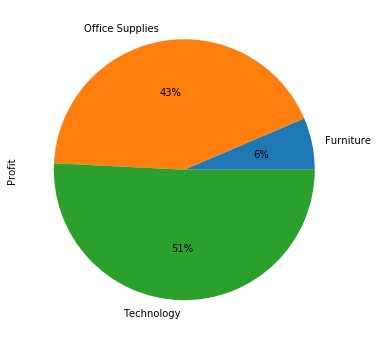


We can find that the profit earned with the products belonging to the **Technology** category were very much high while that earned from the sale of products belonging to the **Furniture** category were comparitively less.


```python
df = store.copy().groupby('Ship Mode')
Profit = df['Profit'].sum()
Profit.plot.pie(y = 'Sales', autopct = '%.0f%%', figsize = (6, 6))
Profit
```


    Ship Mode
    First Class        48969.8399
    Same Day           15891.7589
    Second Class       57446.6354
    Standard Class    164088.7875
    Name: Profit, dtype: float64


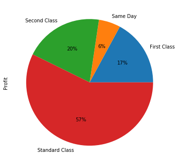


```python
Sales = store.copy().groupby(['Region', 'Category'])['Profit'].sum()
Sales.unstack().plot.bar(stacked = True, figsize = (8, 8)).axhline(y = 0, color = 'red')
Sales
```


    Region   Category       
    Central  Furniture          -2871.0494
             Office Supplies     8879.9799
             Technology         33697.4320
    East     Furniture           3046.1658
             Office Supplies    41014.5791
             Technology         47462.0351
    South    Furniture           6771.2061
             Office Supplies    19986.3928
             Technology         19991.8314
    West     Furniture          11504.9503
             Office Supplies    52609.8490
             Technology         44303.6496
    Name: Profit, dtype: float64


```python
df = store.copy().groupby(['Region', 'Discount'])
Sales = df['Sales'].sum()
Profit = df['Profit'].sum()
Quantity = df['Quantity'].sum()
Profit.unstack().plot.bar(stacked = True, figsize = (6, 6)).axhline(y = 0, color = 'black')
plt.gca().set_title('Profit vs Region w.r.t Discount')
Sales.unstack().plot.bar(stacked = True, figsize = (6, 6)).axhline(y = 0, color = 'black')
plt.gca().set_title('Sales vs Region w.r.t Discount')
Quantity.unstack().plot.bar(stacked = True, figsize = (6, 6)).axhline(y = 0, color = 'black')
plt.gca().set_title('Quantity vs Region w.r.t Discount')
```


    Text(0.5, 1.0, 'Quantity vs Region w.r.t Discount')


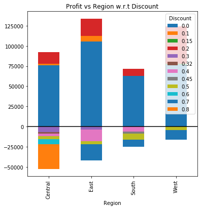


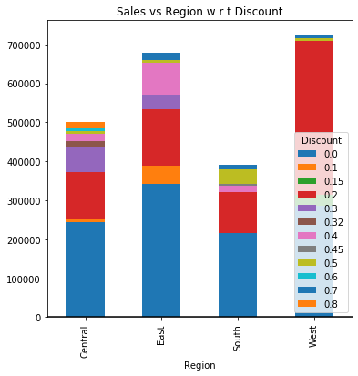


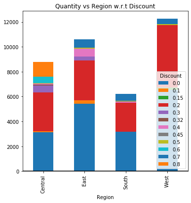


It is found from the above graphs that instead of profit there is a loss incurred in the *Furniture* category mainly in the *central* region. Hence, the sales is to be increased in that region and discounts for the sales must be reduced by a little bit for improved profit.  
The above graph just shows that the maximum discount percentage in which a profit can be seen is only about **0.2%**. Above this discount perentage value a loss in incurred which can be derived from the above graph.  
So, some of the conclusions that can be derived is that:  
1. reduce the discount percentage to smaller percentages.  
2. Profit obtained is higher when there is no discount provided.  
3. Sales is higher when discount percentages are 0% and 0.2%.  
4. The graph on Quantity sold also depicts that the number of quantities sold is higher when the discount percentage is **0** or **0.2%**.


```python
df = store.copy().groupby(['Category', 'Discount'])
Quantity = df['Quantity'].sum()
Quantity.unstack().plot.bar(stacked = True, figsize = (8, 8))
```


    <matplotlib.axes._subplots.AxesSubplot at 0x1b698257748>


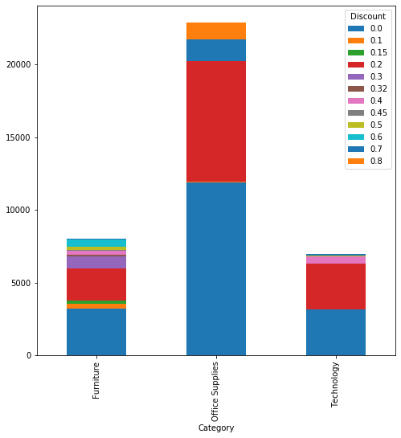


```python
df = store.copy().groupby(['Category', 'Discount'])
Quantity = df['Quantity'].sum()
fig, (ax1, ax2, ax3) = plt.subplots(3, figsize = (15, 15))
ax1.pie(Quantity['Furniture'], autopct = '%.0f%%', labels = Quantity['Furniture'].index)
ax1.set_title('Furniture')
ax2.pie(Quantity['Office Supplies'], autopct = '%.0f%%', labels = Quantity['Office Supplies'].index)
ax2.set_title('Office Supplies')
ax3.pie(Quantity['Technology'], autopct = '%.0f%%', labels = Quantity['Technology'].index)
ax3.set_title('Technology')
```


    Text(0.5, 1.0, 'Technology')


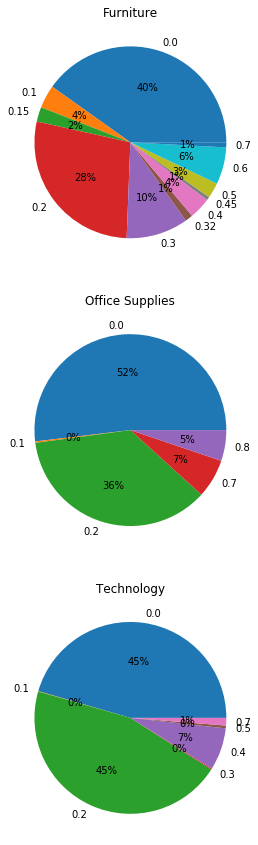


```python
df = store.copy().groupby(['Segment', 'Discount'])
Quantity = df['Quantity'].sum()
fig1, (ax4, ax5, ax6) = plt.subplots(3, figsize = (15, 15))
ax4.pie(Quantity['Consumer'], autopct = '%.0f%%', labels = Quantity['Consumer'].index)
ax4.set_title('Consumer')
ax5.pie(Quantity['Corporate'], autopct = '%.0f%%', labels = Quantity['Corporate'].index)
ax5.set_title('Corporate')
ax6.pie(Quantity['Home Office'], autopct = '%.0f%%', labels = Quantity['Home Office'].index)
ax6.set_title('Home Office')
```


    Text(0.5, 1.0, 'Home Office')


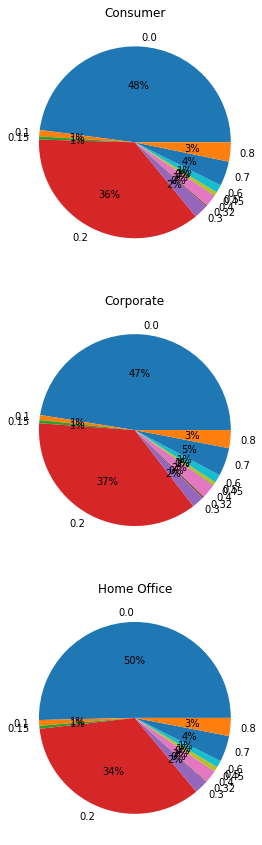


The above graphs also depicts clearly that the number of quantities sold in each category and each segment is higher when the discount percentages are **0** or **0.2%**.


```python
df = store.copy().groupby(['Segment', 'Category'])
Sales = df['Sales'].sum()
Sales.unstack().plot.bar(stacked = True, figsize = (8, 8))
```


    <matplotlib.axes._subplots.AxesSubplot at 0x1b6987ab748>


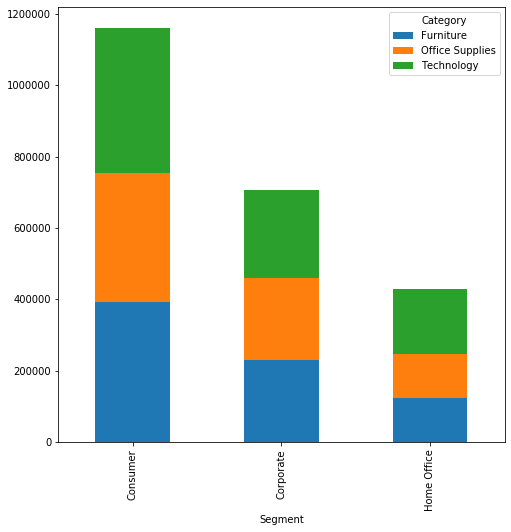


```python
df = store.copy().groupby(['Segment', 'Category'])
Profit = df['Profit'].sum()
Profit.unstack().plot.bar(stacked = True, figsize = (8, 8))
```


    <matplotlib.axes._subplots.AxesSubplot at 0x1b698824088>


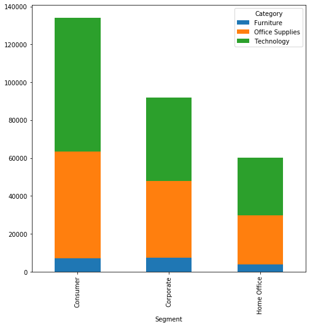


```python
df = store.copy().groupby(['Discount', 'Segment'])
Profit = df['Profit'].sum()
Profit.unstack().plot.bar(stacked = True, figsize = (8, 8)).axhline(y = 0, color = 'red', linewidth = 0.5)
```


    <matplotlib.lines.Line2D at 0x1b698f61848>


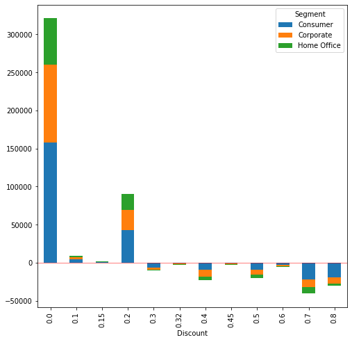


### Conclusions

Some of the conclusions that can be derived from performing the exploratory data analysis on the **SampleSuperStore** dataset is:  
1. Discount:  
    Discount percentages should be maintained within **0.2%** to increase the sales as well as profit.  
2. Category:  
    More profits are obtaines in the **Office Supplies** and **Technology** categories and so try to increase the sales in those categories.  
3. Segment:  
    Sales and profits obtained are higher with the **consumers** when compared to others and so should focus on getting in more and more consumers.  
4. Ship Mode:  
    The sales and profits obtained is higher with **Standard Class** mode and so try to use this mode for selling more and more products.  
5. State:  
    1. States with higher sales are **California followed by New York, Texas, Washington and Pennsylvania** and so we can easily improve the sales in these states.
    2. States with very lower sales are **District of Columbia, Idaho, Iowa, Kansas, Maine, Montona, New Mexico and South Carolina** and so to improve the business in these states new customers needs to be brought in and the discount percentages in these states must be increased by a little bit to attract new customers and to improve the sales with the existing customers.  
6. Region:
    The sales are higher in the regions **East** and **West** but the sales are very much lower in the **Southern** region. So as said above bringing in new customers and providing some discounts to the customers in these areas could improve the sales in the *southern* region.
7. Sub-Category:  
    1. Best Selling Products:  
        Some of the products that are best selling in any region (or) any area are **Chairs and Phones**.  
    2. Low Sales Products:  
        Some of the products that did not sell well in any region (or) any area (or) any type of cutomers are **Art, Envelopes, Fasteners and Labels**. So the sales of these products needs to be increased.  

## Thank You
